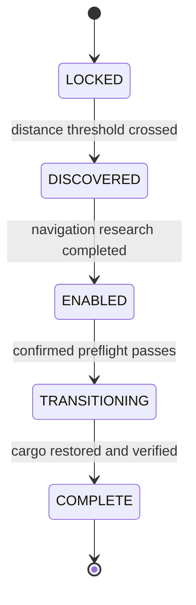

# Architecture

## Design goals

The runtime is organized around four constraints:

1. **Major phase is persisted; readiness is derived.** A mined vessel or departing platform cannot leave stale readiness state behind.
2. **The transition is fail-closed.** Every destructive operation is preceded by validation and a recovery save.
3. **Cargo remains engine-native.** Stack transfer preserves quality and item metadata instead of serializing items into simplified tables.
4. **One transition means one commit point.** A force that reaches `COMPLETE` cannot enter the loop again.

## State machine



Only these five states are stored. Vessel validity, platform location, player presence, cargo weight, and personal inventory contents are recalculated from current Lua objects.

## Module map

| Module | Responsibility | Must not own |
|---|---|---|
| `scripts/config.lua` | Names and balance values | Mutable mission state |
| `scripts/state.lua` | Schema creation, migration, force/player records | Gameplay decisions |
| `scripts/discovery.lua` | Platform scan and scripted signal | GUI construction |
| `scripts/vessel.lua` | Placement, ownership, recovery, refunds | Jump authorization |
| `scripts/cargo.lua` | Weight and lossless stack transfer | World deletion |
| `scripts/readiness.lua` | Structured checklist and preflight inputs | Persistent phases |
| `scripts/modifiers.lua` | Fixed carryover snapshot/restore | Technology unlocks |
| `scripts/reset.lua` | Destructive transaction coordinator | Event registration |
| `scripts/gui.lua` | Mission panel and confirmation dialog | Trusted authorization |
| `scripts/commands.lua` | Administrator diagnostics and test helpers | Silent cheats in release mode |
| `control.lua` | Event wiring and lifecycle orchestration | Domain logic |

## Persisted schema

```lua
storage.tvh = {
  schema_version = 1,
  forces = {
    [force_index] = {
      phase = "LOCKED",
      max_shattered_distance_km = 0,
      discovery_tick = nil,
      vessel_unit_number = nil,
      vessel_platform_index = nil,
      vessel_destroy_registration = nil,
      transition_nonce = nil,
      transition_seed = nil,
      transition_step = nil,
      completed_tick = nil
    }
  },
  players = {
    [player_index] = {
      mission_gui_visible = false,
      confirmation_open = false
    }
  }
}
```

The schema version is advanced only through `scripts/migrations.lua`. Stored Lua object references are avoided; unit numbers and platform indexes are re-resolved after load.

## Event flow

| Event | Action |
|---|---|
| `on_init` | Create schema, initialize forces and players, lock staging |
| `on_configuration_changed` | Migrate schema, reconcile force phase and vessel registration |
| Every 60 ticks | Scan platform distance and refresh visible mission panels |
| Research finished | Move `DISCOVERED` to `ENABLED`; unlock staging |
| Build events | Validate platform-only placement and single-vessel ownership |
| Mine/die/destroy events | Clear the matching vessel registration |
| Platform state change | Refresh derived readiness immediately |
| GUI events | Toggle mission panel, open confirmation, or run final guarded action |

## Transition boundary

### Pre-commit work

- Validate single-player state and all Lua objects.
- Verify staging, player presence, empty personal inventories, and cargo weight.
- Verify a 48-slot temporary inventory can accept every vessel stack.
- Verify Nauvis and transit-surface constraints.
- Create the recovery autosave.
- Snapshot cargo and allowlisted modifiers.

Failures before destructive work return cargo to the vessel and leave the phase `ENABLED`.

### Destructive work

The force phase becomes `TRANSITIONING` only after snapshots succeed. Each completed step is logged and stored in `transition_step` so a failed save is diagnosable. The named autosave is the recovery mechanism; the mod does not attempt speculative rollback after world deletion begins.

### Commit

`COMPLETE` is written only when every temporary cargo stack has entered the arrival cache and the player is safely back on Nauvis. The nonce and seed remain for auditability.

## Compatibility boundary

Only surfaces associated with the vanilla Space Age locations `nauvis`, `vulcanus`, `gleba`, `fulgora`, and `aquilo` are regenerated. Other-mod surfaces are intentionally left untouched. Compatibility with overhaul progression is not guaranteed.
